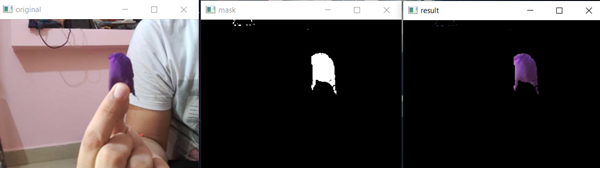
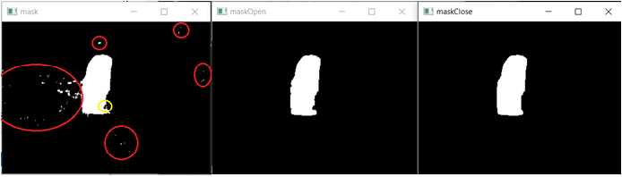
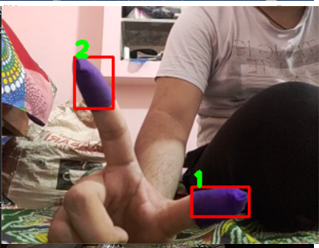
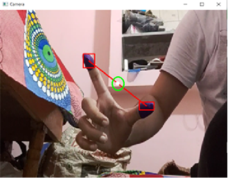
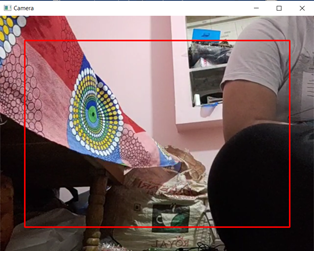
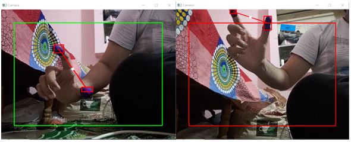
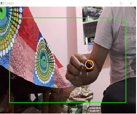
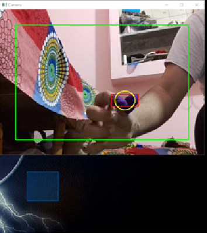

# Virtual Mouse with gesture control

The project is about controlling cursor movement and actions using gestures. We have used computer vision in this project where the camera would detect the object(s) (finger gloves) and perform operations accordingly. If there are two objects detected then it will control the movement of cursor and if there is one object, it will execute clicking and dragging operations.
Libraries used :
* OpenCV-Python	
* Numpy
* WxPython
* Pynput

## Steps followed

- Color Detection

- Mask filtering

- Object Tracking

- Creating pointer to control cursor

- Creating boundary to represent screen

- Moving the cursor (Open gesture)

- Preforming click and dragging (Close gesture)

- Fine Tuning
    1) Position Flickering
    2) Coontinuous clicking
    3) Clicking when single object detected

  
